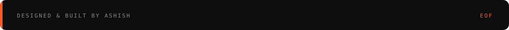

<!-- ───────────────────────── HEADER ───────────────────────── -->
<p align="center">
  <a href="https://oglic.com">
    
  </a>
</p>

<p align="center">
  <a href="https://oglic.com"></a>
  <a href="https://ashishramtekkar.com"></a>
  <a href="https://www.linkedin.com/in/ashishramtekkar/"></a>
  <a href="mailto:itsashiish@gmail.com"></a>
</p>

<br />

I design and build digital products — **brand systems, product interfaces, and small tools that solve real problems.**

My background spans business analysis and AI, so I treat design the way I treat workflows: **as systems that should hold up at scale.**

```ts
// now.ts — last updated Oct 2026
const ashish = {
  role:      "Product & Visual Designer",
  founder:   "Oglic — an independent studio of free, privacy-first web tools",
  shipping:  ["logo stress-testing", "logo motion", "kinetic type", "seamless carousels", "brand patterns"],
  workflow:  "Figma → AI-assisted build → Vercel",
  principle: "No accounts. No uploads. Your files never leave your browser.",
  previously:"Graphic Designer @ Kuberhunt (fintech)",
};
```

<br />

## 🚀 Currently

- 🌐 **[Oglic](https://oglic.com)** — an independent studio of free, privacy-first web tools. **25+ live**, no accounts, no uploads.
- 🎨 **Design tools for designers** — tools for brand identity, motion and social media: logo stress-testing, logo motion, kinetic type, seamless carousels and brand patterns.
- 💻 **AI-assisted workflows** — taking ideas from Figma frames to shipped, deployed code.

> **Previously** — Graphic Designer at **Kuberhunt** (fintech): brand system, campaigns, social media, app-store and product marketing assets.

<br />

## 🧰 From the Oglic shelf

<table>
  <tr>
    <td width="33%" valign="top">
      <sub><code>01</code> · LOGO</sub><br />
      <a href="https://kiln.oglic.com"><b>Kiln ↗</b></a><br />
      <sub>Stress-test a logo across 12 real-world conditions.</sub>
    </td>
    <td width="33%" valign="top">
      <sub><code>02</code> · MOTION</sub><br />
      <a href="https://ident.oglic.com"><b>Ident ↗</b></a><br />
      <sub>Turn an SVG logo into an animated brand ident.</sub>
    </td>
    <td width="33%" valign="top">
      <sub><code>03</code> · TYPE</sub><br />
      <a href="https://tempo.oglic.com"><b>Tempo ↗</b></a><br />
      <sub>Animate text in rhythm to a beat, export as video.</sub>
    </td>
  </tr>
  <tr>
    <td width="33%" valign="top">
      <sub><code>04</code> · SOCIAL</sub><br />
      <a href="https://seam.oglic.com"><b>Seam ↗</b></a><br />
      <sub>Slice wide designs into seamless carousel slides.</sub>
    </td>
    <td width="33%" valign="top">
      <sub><code>05</code> · GENERATIVE</sub><br />
      <a href="https://qualia.oglic.com"><b>Qualia ↗</b></a><br />
      <sub>Turn a feeling into abstract generative art.</sub>
    </td>
    <td width="33%" valign="top">
      <sub><code>06</code> · UTILITY</sub><br />
      <a href="https://pdf.oglic.com"><b>PDF Tools ↗</b></a><br />
      <sub>Merge, split and edit PDFs — entirely in your browser.</sub>
    </td>
  </tr>
</table>

<p align="right"><a href="https://oglic.com"><b>See all 25+ tools →</b></a></p>

<br />

## 🛠 Stack

<table>
  <tr>
    <td width="130"><b>Design</b></td>
    <td>
      
      
    </td>
  </tr>
  <tr>
    <td><b>Frontend</b></td>
    <td></td>
  </tr>
  <tr>
    <td><b>Build & Ship</b></td>
    <td>
      
      
    </td>
  </tr>
  <tr>
    <td><b>Other</b></td>
    <td>
      
      
    </td>
  </tr>
</table>

<br />

## 📚 Publication

> **AI-Based Video Summarization Using FFmpeg and NLP** — *IJISRT, 2023*
> An end-to-end system that cut video length by **up to 72%** while keeping the key narrative intact.
>
> [](https://doi.org/10.5281/zenodo.7888972)

<br />

<details>
<summary><b>📊 The numbers</b> <sub>(click to expand)</sub></summary>
<br />
<p align="center">
  
  
</p>
<p align="center">
  
</p>
<p align="center">
  
</p>
</details>

<br />

## 🌍 Find me

| | |
|---|---|
| 🌐 **Portfolio** | [ashishramtekkar.com](https://ashishramtekkar.com) |
| 🧪 **Studio** | [oglic.com](https://oglic.com) |
| 💼 **LinkedIn** | [in/ashishramtekkar](https://www.linkedin.com/in/ashishramtekkar/) |
| 📧 **Email** | [itsashiish@gmail.com](mailto:itsashiish@gmail.com) |

<!-- ───────────────────────── FOOTER ───────────────────────── -->
<p align="center">
  
</p>
